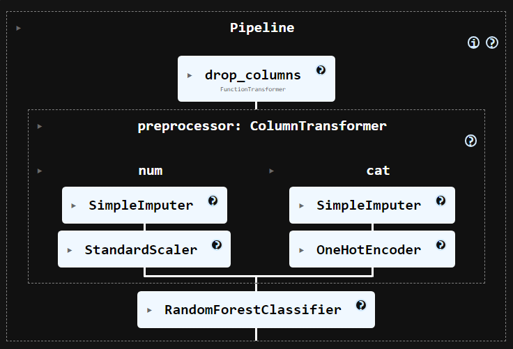
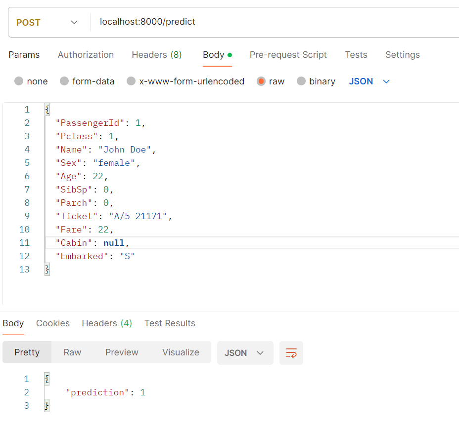
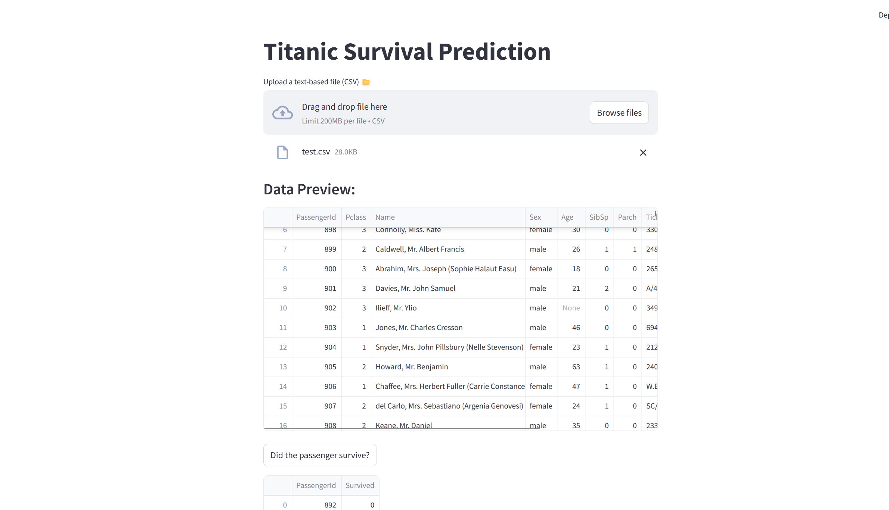

# Projet Big data - Titanic

Double diplôme IA
*BONADA Nathan - LAURENT Clément - LE TRUNG Ethan - RANDRIANTSOA Matthieu*

Ce projet a pour objectif d’entraîner un modèle de Machine Learning sur le dataset Titanic afin de prédire si un passager a survécu ou non en fonction de ses caractéristiques. L'objectif est de mettre en production ce modèle en développant une API de serving et en l'intégrant dans un pipeline complet, le tout conteneurisé avec Docker.

## Structure du projet

**data/** : Contient le fichier *ref_data.csv* après prétraitement. ainsi que le fichier *test_data.csv* qui sont les données surlesquelles on va tester notre modèle.

**scripts/** : Contient les scripts Python pour le prétraitement et l'entraînement du modèle.

**artifacts/** : Contient le modèle entraîné, le scaler et la pipeline.

**serving/** : Contient l'API de serving développée avec FastAPI.

## Prétraitement des Données

Le fichier *EDA.ipynb* détaille les données du titanic afin de mieux comprendre le liens entre les caractéristiques et les personnes ayant survécu. Il explique en détail le processus réalisé par le script *process_data.py*

Le script *process_data.py* réalise :
- Chargement des données depuis un fichier CSV
- Suppression des colonnes inutiles (Name, Ticket, Cabin)
- Remplacement des valeurs manquantes (Age, Embarked)
- Encodage des variables catégorielles (Sex, Embarked)
- Normalisation des variables numériques (Age, Fare)
- Sauvegarde du dataset nettoyé sous data/ref_data.csv

Format du fichier *ref_data.csv* après prétraitement:

|   colonne    |   Description    |
|---    |--:    |
|    Survived   |    0 = N’a pas survécu, 1 = A survécu    |
|    Pclass   |    Classe du passager (1 = Première, 2 = Deuxième, 3 = Troisième)   |
|   Sex    |    0 = Femme, 1 = Homme   |
|   Age    |    Âge du passager (normalisé avec StandardScaler)   |
|   SibSp    |   Nombre de frères/sœurs/conjoints à bord    |
|   Parch    |    Nombre de parents/enfants à bord   |
|   Fare    |   Prix du billet (normalisé avec StandardScaler)    |
|   Embarked    |   Port d’embarquement (0 = Cherbourg, 1 = Queenstown, 2 = Southampton)    |

### Génération de passagers fictifs

Le script *generate_data.py* permet de simuler des données supplémentaires pour tester le modèle.
- Analyse la distribution des colonnes (Pclass, Sex, Age, etc.).
- Génère 1 000 passagers fictifs.
- Normalise  les colonnes Age et Fare comme pour *ref_data.csv*.
- Sauvegarde des passagers générés dans *test_data.csv*.

à la fin on obtient test_data.csv qui sera le fichier utilisé pour tester notre modèle.

## Entraînement du Modèle
Le choix et l'entraînement du modèle sont expliqués et effectués dans *notebook.ipynb*.

Le modèle est ensuite enregistré sous forme de pipeline dans **artifacts/**.

Les différents composants de la pipeline sont les suivants :
- drop_columns_transformer : Suppression des colonnes inutiles / Garder uniquement les colonnes utiles
- encoder : Encodage des variables catégorielles (Sex & Embarked)
- scaler : Normalisation des variables numériques (Age & Fare)
- train_model : Random Forest Classifier entrainé sur le dataset Titanic
- pipeline : Pipeline regroupant les différents composants
- fixed_pipeline : Pipeline sans le composant drop_columns_transformer (fonctionne mieux pour l'API)



## Partie API

Une API de serving a été développée avec FastAPI pour permettre d'interroger le modèle.

Le code se situe dans **serving/**.

POST
http://127.0.0.1:8080/predict/



Pour lancer l'API manuellement, il suffit de lancer la commande :

```bash
$ fastapi dev api.py
```
Ou alors on se déplace dans le fichier serving et on utilise la commande :
```bash
$ uvicorn api:app --host 127.0.0.1 --port 8080
```

## Interface

Une interface est mise à disposition, pour l'utiliser manuellement il suffit de se rendre dans **webapp/** et d'utiliser la commande suivante :
```bash
$ streamlit run app.py
```

voici à quoi devrait ressembler l'interface après avoir lancé la prédiction : 



## Dockerisation

La librairie pipreqs a été utilisée ici afin de générer le fichier requirements.txt et ne lister que les librairies nécessaires à ce projet via la commande :

```bash
$ pipreqs --encoding=utf8
```

Pour build l'image Docker de l'api et la run:

```bash
$ Docker build -t api_titanic .
$ Docker run -p 8080:8080 api_titanic
```

Le -t permet de donner à l'image le nom api_titanic.
Le "." sert à indiquer que le Dockerfile utilisé pour construire cette image se trouve dans le répertoire actuel.

# Brouillon

//Une erreur peut survenir durant le build de l'image car l'import de certaines librairies prend énormément de temps (xgboost notamment xgboost==2.1.4).
Il est possible de lancer uniquement l'api en laissant juste les 2 premières lignes dans requirements : uvicorn et fastapi.//

Reste à faire :
Pour le moment on peut lancer manuellement l'api et l'interface =>
- Lancer API : dans /serving
uvicorn api:app --host 127.0.0.1 --port 8080

- Lancer Webapp: dans /webapp
streamlit run app.py

Il faut faire un docker compose pour automatiser 

